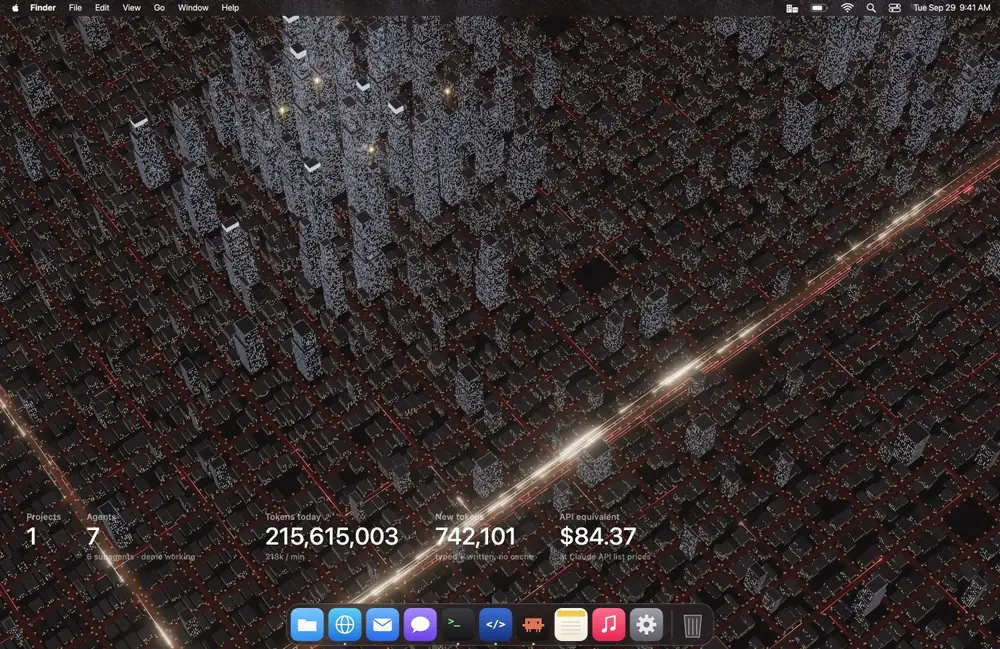
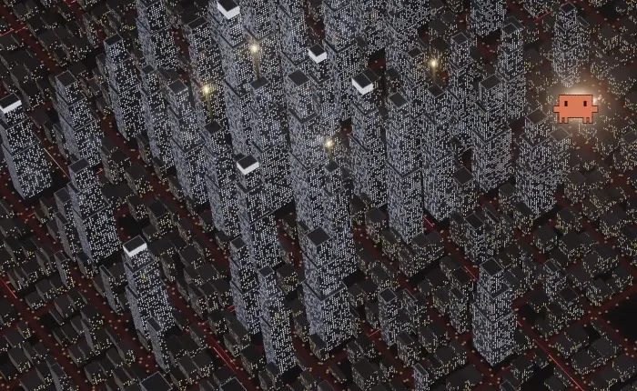

# Agent City

A live macOS wallpaper that turns your Claude Code activity into a night city. It stays dark while nothing is happening. When your agents start spending tokens, the windows light up, traffic fills the avenues, and every finished response falls on the city as a meteor carrying the Claude Code mascot.



Inspired by the [@internetphysics demo](https://x.com/internetphysics/status/2104305710079119649). This is an unofficial fan project, not affiliated with or endorsed by Anthropic. Claude and the Claude Code mascot belong to Anthropic.

## What you see

| In Claude Code | In the city |
|---|---|
| Tokens start flowing | Windows switch on, tallest towers first; crowns and spires light up; traffic starts |
| A response finishes | A meteor carrying the mascot falls on that project's tower, and the tower lights up from the roof down. Subagents land on the blocks around it. Bigger responses make bigger meteors, and each one lands with a soft thump |
| A burst of tokens | More traffic on the avenues |
| Nothing for 60 seconds | The city fades back to rest and stops rendering |

<p align="center"></p>

The counters in the lower left show the projects and agents active right now, all tokens today (including cache reads), new tokens today (input and output only), and what today's usage would cost at Claude API list prices.

## Requirements

- macOS 13 or later
- [Claude Code](https://code.claude.com): the city reads its session logs in `~/.claude/projects`
- Node.js 20.11 or later
- Xcode Command Line Tools, to compile the small Swift app: `xcode-select --install`

## Install

```bash
git clone https://github.com/lucacadalora/agent-city.git
cd agent-city
./build.sh
```

`build.sh` installs three.js, builds `~/Applications/AgentCity.app` and starts it. It also:

- adds a launchd agent, so the wallpaper starts when you log in and comes back if it crashes;
- sets your desktop picture to a still of the city, so you see the city even when the live window isn't on screen (right after login, in Mission Control). Your original picture is saved, and **Quit and Restore Original Wallpaper** puts it back.

A building icon appears in the menu bar with **Reload Wallpaper**, **Demo Mode** (a scripted loop, handy for trying it without running agents), **Battery Saver** (30 fps), **Sound**, **Open in Browser**, **Quit** and **Quit and Restore Original Wallpaper**.

## Uninstall

Choose **Quit and Restore Original Wallpaper** from the menu bar icon, then remove the launchd agent and the app:

```bash
launchctl bootout gui/$UID/local.agentcity.wallpaper
rm ~/Library/LaunchAgents/local.agentcity.wallpaper.plist
rm -rf ~/Applications/AgentCity.app ~/Library/Application\ Support/AgentCity
```

## Privacy

Everything stays on your Mac. The app reads Claude Code's local session logs and serves the page on `127.0.0.1:4545` only; it makes no other network requests. From the logs it uses only token counts, timestamps, model names and project folder names. Conversation content is never stored or shown.

## How it works

- `server.mjs` tails `~/.claude/projects/**/*.jsonl` and serves the current state, plus each newly finished response, at `http://127.0.0.1:4545/state`.
- `public/app.js` draws the city with three.js: procedural buildings, window lights, traffic trails, meteors and bloom, with the pixel-art mascots on an overlay canvas. The impact sounds are synthesized with Web Audio; there are no audio files.
- `mac/AgentCity.swift` shows the page in one borderless window per screen at desktop level (below the icons, on every Space), starts the server and adds the menu bar item. It uses private WebKit settings to keep animating behind the desktop icons, so a future macOS update could break that part.

| Signal | Where it comes from | Effect |
|---|---|---|
| Working | any usage logged in the last 60 s | the city lights up and traffic runs |
| Finished response | the first log line of a response that has a `stop_reason` | a meteor lands on the project's tower (one tower per working directory). The mascot comes in five sizes, stepping up at 300, 1,000, 3,000 and 10,000 output tokens; subagents are one size smaller. Sound plays on the main screen only, at most 4 hits per half second |
| Projects / Agents | session logs written in the last 90 s; subagents are `agent-*.jsonl` | counters |
| Tokens today | input + output + cache writes + cache reads, counted once per response | counter; `k / min` is a trailing 60-s sum |
| API equivalent | the same usage priced per model, from the table in `server.mjs` | counter |

Rendering only happens while agents are working. On battery, **Battery Saver** in the menu halves the frame rate.

## Develop

1. Edit `public/app.js` or `server.mjs`.
2. Preview in a browser: `node server.mjs`, then open `http://127.0.0.1:4545/?demo=1` (or `?force=active&instant=1` / `?force=idle&instant=1`).
3. Run `./build.sh`. It rebuilds and restarts the app, which runs its own bundled copy.

Page options: `fps=30`, `dpr=1.5`, `demo=1`, `force=idle|active`, `instant=1`, `sound=1`.
In the browser console, `__meteor(5000)` drops a test meteor (`__meteor(3000, true)` for a subagent).
Health check: `curl http://127.0.0.1:4545/debug` shows the state and each wallpaper's frame, meteor and sound counts.
Server log: `~/Library/Logs/AgentCity.log`.

## License

[MIT](LICENSE)
